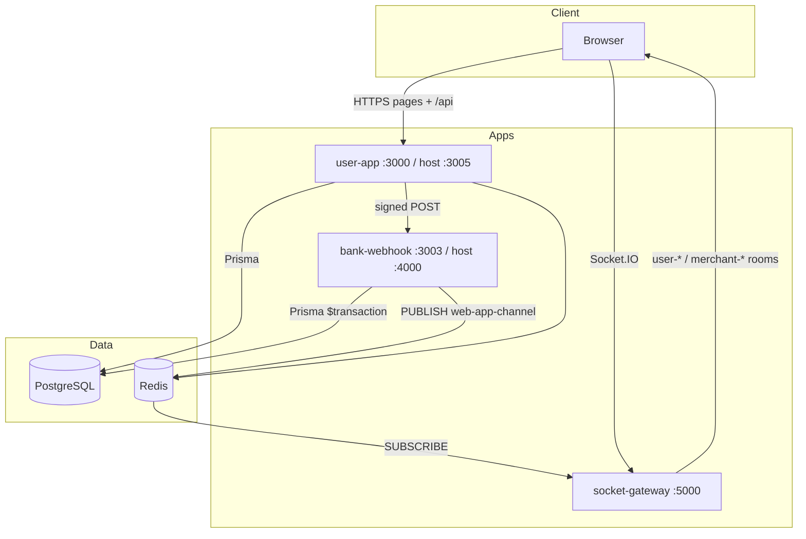
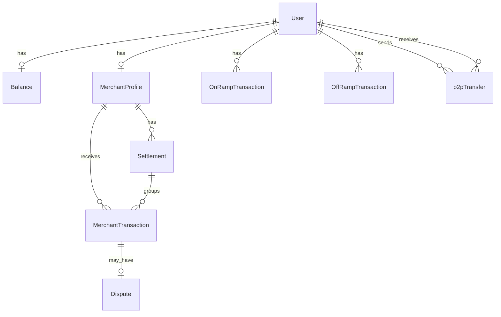

# PakPay

**PakPay** is a fintech MVP that simulates a digital wallet and merchant payment platform for Pakistan. Consumers top up via a simulated bank (on-ramp), send P2P transfers, pay verified merchants, and withdraw (off-ramp). Merchants receive wallet credits, view analytics, pass manual KYC, and receive T+2 settlements. Admins approve KYC, resolve disputes, and oversee transactions.

**Live demo:** [https://pakpay.site](https://pakpay.site)

> **Disclaimer:** PakPay is a portfolio / demonstration system. It is **not** a licensed payment institution, bank, or e-money issuer. Do not use with real customer funds without legal, compliance, and security review.

---

## Table of Contents

- [App Overview](#app-overview)
- [Tech Stack](#tech-stack)
- [Architecture](#architecture)
- [Getting Started](#getting-started)
- [Features](#features)
- [API Reference](#api-reference)
- [Database Schema](#database-schema)
- [Auth & Security](#auth--security)
- [Financial Logic](#financial-logic)
- [Deployment](#deployment)
- [Testing](#testing)
- [Documentation](#documentation)
- [Known Limitations & TODOs](#known-limitations--todos)
- [Contributing](#contributing)

---

## App Overview

### What it does

PakPay models core flows of a Pakistani digital wallet:

- **Wallet ledger** — balances stored in **paisa** (1 PKR = 100 paisa) with **locked** funds for in-flight payments and withdrawals.
- **Simulated banking** — on-ramp / off-ramp via an internal Express service with **HMAC-signed webhooks**.
- **Merchant acceptance** — QR / pay links, payment webhooks, T+2 settlement cron, PDF statements.
- **Governance** — manual KYC, dispute handling, audit logs for admin actions.
- **Real-time UX** — Socket.IO rooms per user / merchant for deposit and payment notifications.

### Who it's for

| Role | Primary users | Core value |
|------|---------------|------------|
| **USER** | End consumers | Wallet, P2P, merchant pay, disputes |
| **MERCHANT** | Shop owners | Accept payments, analytics, settlements, KYC |
| **ADMIN** | Platform operators | KYC review, disputes, transaction oversight |

### Value proposition

A **production-shaped monorepo** (event-driven webhooks, signed callbacks, Redis rate limits, role-based access, transactional ledger) suitable for demos, interviews, and learning — not for regulated production banking without substantial hardening.

---

## Tech Stack

| Layer | Technology |
|-------|------------|
| **Language** | TypeScript (Node.js ≥ 18) |
| **Monorepo** | Turborepo, Yarn workspaces |
| **Frontend** | Next.js 14 (App Router), React, Tailwind CSS |
| **Client state** | Recoil (`@repo/store`) |
| **API** | Next.js Route Handlers (`apps/user-app/src/app/api/*`) |
| **Auth** | NextAuth.js (Credentials, JWT, 8h session, hourly rotation) |
| **Bank simulation** | Express (`apps/bank-webhook`), HMAC-SHA256 (`@repo/webhook-signing`) |
| **Real-time** | Socket.IO (`apps/socket-gateway`) + Redis pub/sub |
| **Database** | PostgreSQL + Prisma (`packages/db`) |
| **Cache / limits** | Redis (rate limits, login lockout, pub/sub) |
| **File storage** | Cloudinary (KYC documents, logos) |
| **Email** | Nodemailer (Gmail SMTP — password reset, contact) |
| **PDF** | pdfkit / pdf-lib (merchant statements) |
| **CI/CD** | GitHub Actions → Docker Hub → AWS EC2 |
| **Tests** | Vitest (unit), Playwright (e2e), `security-test.js` |

---

## Architecture

### System diagram



### Repository layout

```
PakPay/
├── apps/
│   ├── user-app/           # Next.js UI + REST API
│   ├── bank-webhook/       # Balance mutations from bank callbacks
│   └── socket-gateway/     # WebSocket notification fan-out
├── packages/
│   ├── db/                 # Prisma schema, migrations, seed
│   ├── webhook-signing/    # HMAC sign/verify
│   ├── store/              # Recoil atoms
│   ├── ui/                 # Shared components
│   └── config-*            # ESLint, Tailwind, TS
├── docker/                 # Dockerfiles
├── docker-compose.yml
├── docs/
│   ├── FEATURE_TESTING.md  # Code-path test report (Phase 3)
│   └── MVP_READINESS.md    # Launch readiness (Phase 4)
└── scripts/k6/             # Load smoke tests
```

### Architectural pattern

**Modular monorepo** with **thin route handlers** — no dedicated domain service layer. Business logic lives in:

- `apps/user-app/src/app/api/**` and server actions
- `apps/bank-webhook/src/index.ts` (authoritative bank-simulated balance changes)
- Shared libs: `money.ts`, `balanceLocks.ts`, `signedBankWebhook.ts`, `validation/schemas.ts`

---

## Getting Started

### Prerequisites

- Node.js ≥ 18
- Yarn 1.x
- PostgreSQL 14+
- Redis 6+

### Environment setup

```bash
cp .env.example .env
# Edit DATABASE_URL, secrets, and public URLs
```

### Environment variables

| Variable | Required | Description |
|----------|----------|-------------|
| `DATABASE_URL` | Yes | PostgreSQL connection string |
| `PRISMA_ACCELERATE_URL` | No | Prisma Accelerate (optional) |
| `NEXTAUTH_SECRET` | Prod: Yes | Session signing (≥ 32 chars in production) |
| `JWT_SECRET` | Prod: Yes | Fallback / legacy secret |
| `NEXTAUTH_URL` | Yes | Public app URL (e.g. `https://pakpay10.site`) |
| `NEXT_PUBLIC_BASE_URL` | Yes | Baked at **build** time; QR / pay links |
| `NEXT_PUBLIC_SOCKET_URL` | Yes | Baked at **build** time; Socket.IO client |
| `BANK_WEBHOOK_URL` | Yes | Internal URL (e.g. `http://bank-webhook:3003`) |
| `BANK_WEBHOOK_SECRET` | Yes | Shared HMAC secret (user-app + bank-webhook) |
| `REDIS_URL` | Yes | Rate limits, lockout, pub/sub |
| `CRON_SECRET` | Prod: Yes | Bearer token for `/api/cron/auto-settlement` |
| `SOCKET_CORS_ORIGIN` | Yes | Allowed Socket.IO origin(s), comma-separated |
| `EMAIL_USER` / `EMAIL_PASS` | No | SMTP for contact & password reset |
| `CLOUDINARY_CLOUD_NAME` / `API_KEY` / `API_SECRET` | No | KYC & logo uploads |
| `ENFORCE_HTTPS` | No | Redirect HTTP→HTTPS on page routes |
| `ENABLE_HSTS` | No | HSTS header when behind TLS |
| `LOG_LEVEL` | No | `info` (prod) / `debug` (dev) |

Never commit `.env`. Seed passwords belong in gitignored `packages/db/prisma/seed.credentials.local.ts` (copy from `seed.credentials.example.ts`).

### Install, migrate, seed

```bash
yarn install
npm run db:generate
npm run db:migrate
cp packages/db/prisma/seed.credentials.example.ts packages/db/prisma/seed.credentials.local.ts
# Edit seed.credentials.local.ts
npm run db:seed
```

### Run — development (no Docker)

```bash
# Terminal 1 — Next.js (default :3000; compose maps :3005)
cd apps/user-app && yarn dev

# Terminal 2 — bank webhook
cd apps/bank-webhook && yarn dev

# Terminal 3 — socket gateway
cd apps/socket-gateway && yarn dev
```

Ensure Redis and PostgreSQL are running locally.

### Run — Docker Compose

```bash
docker compose up -d --build
docker exec -it <user-app-container> npx prisma migrate deploy --schema=packages/db/prisma/schema.prisma
npm run db:seed   # from host with DATABASE_URL pointing at DB
```

| Service | Container port | Host port |
|---------|----------------|-----------|
| user-app | 3000 | 3005 |
| bank-webhook | 3003 | 4000 |
| socket-gateway | 5000 | 5000 |
| redis | 6379 | 6379 |

### Run — production build

```bash
npm run build
npm run start-user-app      # Next.js production
npm run start-bank-webhook  # Express production
# socket-gateway: see apps/socket-gateway/package.json
```

Schedule settlement cron (daily example):

```bash
curl -X POST "$NEXT_PUBLIC_BASE_URL/api/cron/auto-settlement" \
  -H "Authorization: Bearer $CRON_SECRET"
```

---

## Features

| Feature | Behavior |
|---------|----------|
| **Registration** | Email + phone + password; role `USER` or `MERCHANT`; creates `Balance` at 0; merchant gets `MerchantProfile`. |
| **Sign in** | NextAuth credentials; bcrypt; Redis login lockout after failed attempts. |
| **Session security** | JWT max 8h; reissue every 1h activity; `sessionVersion` invalidated on password reset. |
| **Password reset** | Hashed token, 15 min expiry, email link; bumps `sessionVersion`. |
| **On-ramp** | Creates `OnRampTransaction` (`Processing`); client calls `/api/onramp-proxy` → `hdfcWebHook` credits balance. |
| **Off-ramp** | Locks funds on create; proxy → `withdrawWebHook` debits gross + releases lock on success. |
| **P2P transfer** | Server action; `FOR UPDATE` on sender; debits spendable balance (`amount - locked`). |
| **Pay merchant** | Locks funds on `PENDING`; webhook credits merchant; finalizes customer debit on `SUCCESS`. |
| **QR / pay link** | Public `/pay?mid=&type=&ref=`; merchant must be KYC `VERIFIED`. |
| **Merchant KYC** | Upload CNIC / proof via Cloudinary; admin `APPROVE` / `REJECT`. |
| **Settlements** | Cron T+2: webhook debits merchant only after success; txns marked settled after webhook. |
| **Disputes** | One dispute per transaction (DB unique); admin `REFUND` or `REJECT`. |
| **Analytics** | Merchant 30d revenue, daily chart, top customers. |
| **Statements** | PDF export by month or date range. |
| **Real-time** | User room `user-{id}` for ramp events; `merchant-{id}` for payments / settlements. |
| **Admin** | Merchants list, KYC, disputes, all transactions. |
| **Contact** | Public form with IP rate limit + SMTP. |

---

## API Reference

Base URL: `{NEXT_PUBLIC_BASE_URL}/api`

**Auth:** NextAuth session cookie (`next-auth.session-token` or `__Secure-*` in HTTPS) unless noted.

**Common error shape:**

```json
{ "success": false, "message": "Human-readable error", "error": "Human-readable error" }
```

**Amounts:** Request bodies use **PKR** (whole rupees) for user-facing endpoints; responses often map `amount` to PKR via `withAmountInPkr`. Database stores **paisa**.

---

### Auth

#### `GET|POST /api/auth/[...nextauth]`

NextAuth handlers (sign-in, sign-out, session, CSRF).

#### `POST /api/auth/login`

| | |
|---|---|
| **Auth** | No |
| **Body** | `{ "email": "user@example.com", "password": "secret" }` |
| **Response** | `{ "success": true, "message": "..." }` — does **not** set session cookie |

#### `POST /api/auth/forgot-password`

| | |
|---|---|
| **Auth** | No |
| **Body** | `{ "email": "user@example.com" }` |
| **Response** | Generic success (no email enumeration) |

#### `POST /api/auth/reset-password`

| | |
|---|---|
| **Auth** | No |
| **Body** | `{ "token": "<from-email>", "password": "newpassword8" }` |
| **Response** | `{ "success": true, "message": "..." }` — increments `sessionVersion` |

#### `GET /api/auth/verify-reset-token?token=`

| | |
|---|---|
| **Response** | `{ "valid": true \| false }` |

---

### User

#### `POST /api/register`

| | |
|---|---|
| **Auth** | No (IP rate limited) |
| **Body** | `{ "email", "number", "password", "name", "role": "USER" \| "MERCHANT" }` |
| **Response** | `201` `{ "success": true, "message": "..." }` |

#### `GET /api/user`

| | |
|---|---|
| **Auth** | Session |
| **Response** | `{ "user": { "id", "name", "email", "role" } }` |

#### `GET /api/spending`

| | |
|---|---|
| **Auth** | Session (USER) |
| **Response** | Weekly aggregates for on-ramp, off-ramp, P2P |

---

### Wallet

#### `POST /api/create-onramp`

| | |
|---|---|
| **Auth** | Session |
| **Body** | `{ "amount": 5000, "bank": "HBL" }` |
| **Response** | `{ "success": true, "transaction": { "token", "status": "Processing", "amount": 5000, ... } }` |

#### `POST /api/onramp-proxy`

| | |
|---|---|
| **Auth** | Session (must match `userId` in body) |
| **Body** | `{ "token": "<onramp-token>", "userId": 1 }` |
| **Response** | `{ "success": true }` → triggers `hdfcWebHook` |

#### `POST /api/create-offramp`

| | |
|---|---|
| **Auth** | Session |
| **Body** | `{ "amount", "accountHolderName", "bankName", "accountNumber", "branch?" }` |
| **Response** | `{ "success": true, "transaction": { ... } }` — locks funds |

#### `POST /api/offramp-proxy`

| | |
|---|---|
| **Auth** | Session (own `userId`) |
| **Body** | `{ "token", "user_identifier", "amount?" }` |
| **Response** | `{ "success": true }` |

---

### Payments

#### `POST /api/pay`

| | |
|---|---|
| **Auth** | Session (USER) |
| **Body** | `{ "merchantId": 1, "amount": 250, "ref?": "optional-idempotency-key", "paymentMethod?": "WALLET" }` |
| **Response** | `{ "success": true, "payment": { "id", "amount", "status", "ref" }, "message": "..." }` |

#### `GET /api/pay/merchant?mid=1`

| | |
|---|---|
| **Auth** | **Public** |
| **Response** | `{ "id", "businessName", "logoUrl", "kycStatus" }` or 404 if not verified |

---

### Merchant

| Method | Path | Auth | Notes |
|--------|------|------|-------|
| `GET` | `/api/merchant` | MERCHANT | Profile + QR |
| `GET\|POST` | `/api/qr` | MERCHANT | QR payload |
| `POST` | `/api/merchant/kyc-documents` | MERCHANT | `multipart/form-data` |
| `GET` | `/api/merchant/transactions` | MERCHANT | Payments + settlements |
| `GET` | `/api/merchant/analytics` | MERCHANT | 30d metrics |
| `GET` | `/api/merchant/statement` | MERCHANT | PDF (`?month=` or `?from=&to=`) |

---

### Disputes & admin

| Method | Path | Auth | Body / notes |
|--------|------|------|----------------|
| `GET` | `/api/disputes` | Session | User's disputes |
| `POST` | `/api/disputes` | Session | `{ "merchantTransactionId", "reason" }` → 409 if duplicate |
| `GET` | `/api/admin/merchants` | ADMIN | All profiles |
| `POST` | `/api/admin/kyc` | ADMIN | `{ "merchantId", "action", "reason?" }` |
| `GET` | `/api/admin/transactions` | ADMIN | Platform txns |
| `POST` | `/api/admin/disputes` | ADMIN | `{ "disputeId", "action": "REFUND"\|"REJECT", "note?" }` |

---

### Other

#### `POST /api/contact`

| | |
|---|---|
| **Auth** | No (IP rate limited) |
| **Body** | `{ "name", "email", "message" }` |

#### `POST /api/cron/auto-settlement`

| | |
|---|---|
| **Auth** | `Authorization: Bearer $CRON_SECRET` (required in production) |
| **Response** | `{ "message", "processed", "skipped", "failed" }` |

---

### Bank-webhook service (internal)

Host: `BANK_WEBHOOK_URL` (port 3003). Header: `x-pakpay-signature: sha256=<hex>` over raw JSON body.

| Method | Path | Body (example) |
|--------|------|----------------|
| `GET` | `/health` | — |
| `POST` | `/hdfcWebHook` | `{ "token", "userId", "amount" }` (paisa) |
| `POST` | `/withdrawWebHook` | `{ "token", "user_identifier", "amount" }` |
| `POST` | `/merchantWebHook` | `{ "token", "merchantId", "amount", "customerId" }` |
| `POST` | `/merchantSettlementWebHook` | `{ "settlementId", "merchantId", "amount" }` |

Rate limit: 120 req/min/IP on webhook routes.

---

## Database Schema

PostgreSQL via Prisma. Monetary fields are **integers in paisa**.

### Entity relationship (simplified)



### Tables

| Model | Key fields | Notes |
|-------|------------|-------|
| **User** | `email?`, `number`, `password`, `role`, `sessionVersion` | Unique email, phone |
| **Balance** | `userId`, `amount`, `locked` | `amount` = gross; spendable = `amount - locked` |
| **MerchantProfile** | `userId`, `kycStatus`, `qrPayload`, doc URLs | 1:1 with merchant user |
| **MerchantTransaction** | `merchantId`, `customerId?`, `amount`, `status`, `ref?`, `settled` | `ref` unique for idempotency |
| **Settlement** | `merchantId`, `amount`, `status`, `scheduledFor` | T+2 batch payout |
| **SettlementLock** | `id=1`, `locked` | Cron mutex |
| **OnRampTransaction** | `token`, `status`, `amount`, `provider` | |
| **OffRampTransaction** | `token`, `status`, bank fields | |
| **p2pTransfer** | `fromUserId`, `toUserId`, `amount` | |
| **Dispute** | `transactionId`, `userId`, `status` | `@@unique([transactionId])` |
| **AuditLog** | `merchantId`, `action`, `performedBy` | Admin actions |

### Enums

`UserRole`, `KycStatus`, `TransactionStatus`, `SettlementStatus`, `PaymentMethod`, `OnRampStatus`, `OffRampStatus`, `DisputeStatus`, `MerchantCategory`.

### Indexes (Prisma uniques)

`User.email`, `User.number`, ramp tokens, `MerchantTransaction.ref`, `MerchantProfile.userId`, `MerchantProfile.qrPayload`, `Dispute.transactionId`.

---

## Auth & Security

### Auth flow

1. User submits credentials at `/auth/signin` → NextAuth **Credentials** provider.
2. `validateCredentials()` — bcrypt verify, Redis login lockout on failures.
3. JWT issued (`maxAge` 8 hours, `updateAge` 1 hour).
4. JWT stores `role` and `sessionVersion`; each request re-validates `sessionVersion` against DB.
5. Password reset increments `sessionVersion` → all existing JWTs invalidated.
6. **Pages:** `middleware.ts` guards `/user/*`, `/merchant/*`, `/admin/*` by role.
7. **APIs:** per-route `getServerSession(authOptions)`.

### Role permissions

| Action | USER | MERCHANT | ADMIN |
|--------|:----:|:--------:|:-----:|
| Wallet / P2P / pay | ✅ | — | — |
| Merchant dashboard / KYC | — | ✅ | — |
| Admin KYC / disputes / txns | — | — | ✅ |
| Public pay page (verified merchant) | ✅ | ✅ | ✅ |

### Security controls

| Control | Implementation |
|---------|----------------|
| Webhook authenticity | HMAC-SHA256 (`@repo/webhook-signing`), required in production |
| Rate limiting | Redis — pay, register, ramps, contact |
| Login lockout | Redis — failed attempts per email |
| Cron auth | Bearer `CRON_SECRET` in production |
| Cookies | `httpOnly`, `secure`, `sameSite: none` (cross-site demo) |
| HTTPS | Optional `ENFORCE_HTTPS`, `ENABLE_HSTS` |

---

## Financial Logic

### Balance model

| Field | Meaning |
|-------|---------|
| `amount` | Gross wallet balance (paisa) |
| `locked` | Reserved for in-flight merchant pay or off-ramp |
| **Spendable** | `amount - locked` |
| **Total** | `amount` (locked ⊆ gross) |

### Transaction lifecycles

**On-ramp:** `Processing` → `hdfcWebHook` → `Success` + `amount += value`

**Off-ramp:** create → `locked +=` → webhook success → `amount -=`, `locked -=` → `Success`  
Failure → `locked -=`, status `Failure`

**Merchant pay:**

1. `PENDING` + `locked += amount` (spendable check)
2. `merchantWebHook` → merchant `amount +=`, txn `SUCCESS`
3. `finalizeCustomerMerchantPayment` → customer `amount -=`, `locked -=`
4. Failure → `locked -=`, txn `FAILED`

**P2P:** atomic debit/credit with `FOR UPDATE`; uses spendable balance.

**Settlement (T+2):** cron creates `Settlement` → webhook → on success mark txns `settled` + `SUCCESS`; on failure `FAILED`, txns remain unsettled.

**Dispute refund:** customer `+=`, merchant `-=`, txn `FAILED` + `refunded`.

### Idempotency

- Pay: duplicate `ref` with `SUCCESS` returns existing payment without re-charging.
- Webhooks: merchant pay / settlement skip if already `SUCCESS`.
- Disputes: unique `transactionId`.

---

## Deployment

1. Configure GitHub Actions secrets (`DOCKER_*`, `SSH_*`, `NEXT_PUBLIC_*`, `DATABASE_URL`, etc.).
2. Push to `main` → CI runs unit tests, builds and pushes images, deploys via SSH to EC2.
3. On server: `docker compose pull && docker compose up -d`.
4. Run migrations inside user-app container.
5. Schedule `POST /api/cron/auto-settlement` with `CRON_SECRET`.

**Rebuild required** when changing `NEXT_PUBLIC_BASE_URL` or `NEXT_PUBLIC_SOCKET_URL` (build-time env).

See [`.github/workflows/deploy.yml`](.github/workflows/deploy.yml) for the pipeline.

---

## Testing

```bash
npm ci
npm run db:generate:no-engine
npm test                         # Vitest unit tests
node security-test.js            # Integration (needs running stack)
cd apps/user-app && npm run test:e2e   # Playwright
BASE_URL=http://localhost:3005 k6 run scripts/k6/pay-smoke.js
```

---

## Documentation

| Document | Description |
|----------|-------------|
| [docs/FEATURE_TESTING.md](docs/FEATURE_TESTING.md) | Code-path feature test report with severity flags |
| [docs/MVP_READINESS.md](docs/MVP_READINESS.md) | Fintech MVP launch readiness assessment |

---

## Known Limitations & TODOs

- **Simulated bank** — not a licensed PSP or bank integration.
- **No PCI / card processing** — `CARD` payment method is enum-only.
- **Manual KYC** — no automated AML / identity vendor.
- **Demo security** — credentials auth only; no 2FA / OAuth.
- **Legacy rows** — balances before lock migration may need reconciliation.
- **Low automated coverage** — few integration tests for money paths.
- **Not legal advice** — SBP / SECP / GDPR compliance not implemented.

**Roadmap ideas:** real payment gateway, structured audit log for all ledger writes, admin session hardening, horizontal scaling of webhook workers, fraud rules engine.

---

## Contributing

Fork → feature branch → PR. Do not commit `.env` or `seed.credentials.local.ts`.

## License

See repository `LICENSE` if present.
