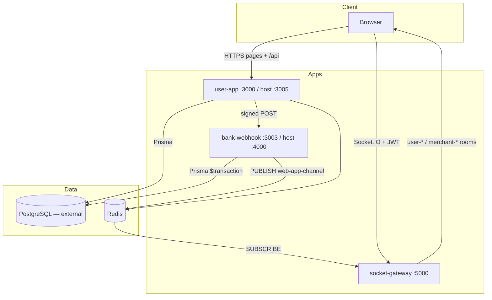

# PakPay

**PakPay** is a fintech demonstration platform that simulates a Pakistani digital wallet and merchant payment system. Consumers top up via a simulated bank, send P2P transfers, pay KYC-verified merchants, and withdraw. Merchants accept QR payments, view analytics, pass manual KYC, and receive T+2 settlements. Admins approve KYC, resolve disputes, and monitor transactions.

**Live demo:** [https://pakpay.site](https://pakpay.site)

> **Disclaimer:** PakPay is a portfolio / demonstration system. It is **not** a licensed payment institution, bank, or e-money issuer. Do not use with real customer funds without legal, compliance, and security review.

**MVP readiness (June 2026):** **90%** — Strong end-to-end demo MVP with production-shaped money flows; not ready for regulated production or real funds.

---

## Table of Contents

- [Project Overview](#project-overview)
- [Tech Stack](#tech-stack)
- [Architecture](#architecture)
- [Feature Status](#feature-status)
- [Getting Started](#getting-started)
- [Environment Variables](#environment-variables)
- [API Overview](#api-overview)
- [Testing & Deployment](#testing--deployment)
- [Current Status](#current-status)
- [Documentation](#documentation)
- [License](#license)

---

## Project Overview

PakPay models core flows of a Pakistani digital wallet:

| Role | Primary users | Core value |
|------|---------------|------------|
| **USER** | End consumers | Wallet, P2P, merchant pay, disputes |
| **MERCHANT** | Shop owners | Accept payments, analytics, settlements, KYC |
| **ADMIN** | Platform operators | KYC review, disputes, transaction oversight |

**Key design choices:**

- Balances stored in **paisa** (1 PKR = 100 paisa) with **locked** funds for in-flight payments and withdrawals
- **Authoritative ledger mutations** in a separate `bank-webhook` Express service with HMAC-signed callbacks
- **Real-time UX** via Socket.IO + Redis pub/sub (JWT-authenticated connections)
- **T+2 settlement** cron with distributed DB lock and zombie-settlement recovery

---

## Tech Stack

| Layer | Technology |
|-------|------------|
| **Language** | TypeScript (Node.js ≥ 18) |
| **Monorepo** | Turborepo, Yarn workspaces |
| **Frontend** | Next.js 14 (App Router), React, Tailwind CSS |
| **API** | Next.js Route Handlers (`apps/user-app/src/app/api/*`) |
| **Auth** | NextAuth.js (Credentials, JWT, 8h session, hourly rotation) |
| **Bank simulation** | Express (`apps/bank-webhook`), HMAC-SHA256 (`@repo/webhook-signing`) |
| **Real-time** | Socket.IO (`apps/socket-gateway`) + Redis pub/sub |
| **Database** | PostgreSQL + Prisma (`packages/db`) |
| **Cache / limits** | Redis (rate limits, login lockout, pub/sub) |
| **File storage** | Cloudinary (KYC documents, logos) |
| **Email** | Nodemailer (password reset, contact) |
| **PDF** | pdfkit / pdf-lib (merchant statements) |
| **CI/CD** | GitHub Actions → Docker Hub → AWS EC2 |
| **Tests** | Vitest (18 unit tests), Playwright (1 smoke test), manual `security-test.js` |

---

## Architecture



### Repository layout

```
PakPay/
├── apps/
│   ├── user-app/           # Next.js UI + REST API (28 route handlers)
│   ├── bank-webhook/       # Authoritative balance mutations from signed webhooks
│   └── socket-gateway/     # WebSocket notification fan-out (JWT auth)
├── packages/
│   ├── db/                 # Prisma schema (11 models), 26 migrations, seed
│   ├── webhook-signing/    # HMAC sign/verify
│   ├── store/              # Recoil atoms (installed but unused in app)
│   ├── ui/                 # Legacy shared components
│   └── config-*            # ESLint, Tailwind, TS
├── docker/                 # Dockerfiles + entrypoint (migrate on start)
├── docker-compose.yml      # 4 services (no bundled Postgres)
├── docs/                   # FEATURE_TESTING.md, MVP_READINESS.md
└── scripts/k6/             # Load smoke tests
```

Business logic lives in route handlers, server actions, and shared libs (`money.ts`, `balanceLocks.ts`, `signedBankWebhook.ts`, `merchantPaymentCompensation.ts`, `validation/schemas.ts`) — no separate domain service layer.

---

## Feature Status

| Feature | Status | Notes |
|---------|--------|-------|
| User registration (USER / MERCHANT) | ✅ Complete | Zod validation, bcrypt, transactional user + balance create |
| Sign in / sign out | ✅ Complete | NextAuth JWT, Redis login lockout |
| Password reset | ✅ Complete | Hashed token, 15 min expiry, `sessionVersion` bump |
| Wallet on-ramp (simulated bank) | ✅ Complete | Lock + signed webhook credit; idempotent via `FOR UPDATE` |
| Wallet off-ramp (simulated bank) | ✅ Complete | Fund lock on create, release on failure |
| P2P transfer | ✅ Complete | Deadlock-safe `FOR UPDATE`, Zod amount validation |
| Pay merchant (wallet) | ✅ Complete | Lock → webhook → finalize saga with compensation |
| Pay merchant (bank top-up first) | ✅ Complete | Bank modal → on-ramp → wallet pay |
| QR / pay link | ✅ Complete | KYC `VERIFIED` gate on public merchant lookup |
| Merchant dashboard & analytics | ✅ Complete | 30d revenue, chart, top customers |
| Merchant transactions & CSV export | ✅ Complete | Payments + settlements |
| Merchant PDF statements | ✅ Complete | Monthly or date range |
| Merchant KYC upload | ✅ Complete | Cloudinary; admin approve/reject |
| T+2 auto-settlement cron | ✅ Complete | `SettlementLock`, zombie recovery, signed webhook |
| Disputes (user + admin) | ✅ Complete | One per txn; admin REFUND / REJECT |
| Admin KYC & transaction monitor | ✅ Complete | Overlaps dashboard + dedicated pages |
| Real-time notifications | ✅ Complete | Socket.IO with NextAuth JWT verification |
| Marketing / legal pages | ✅ Complete | About, terms, privacy, contact |
| 2FA / OTP | ✅ Complete |
| OAuth / passkeys ✅ Complete |
| Email / SMS receipts ✅ Complete |
| User transaction CSV export | 🚧 Partial | Merchant CSV only; user has on-page export |
| Comprehensive automated tests | 🚧 In progress | 18 Vitest + 1 Playwright smoke |
| Real payment gateway (1Link, etc.) | ❌ Missing | Simulated bank only |
| Card payments (`CARD` enum) | ❌ Missing | Schema only; UI uses WALLET / BANK_TRANSFER |
| Automated KYC / AML vendor | ❌ Missing | Manual document review |
| Double-entry ledger / reconciliation jobs | ❌ Missing | Single `Balance` table |
| Fraud rules (velocity, device) | ❌ Missing | Basic Redis rate limits only |
| Mobile app | ❌ Missing | Web responsive only |
| Regulatory reporting (SBP/SECP) | ❌ Missing | |

---

## Getting Started

### Prerequisites

- Node.js ≥ 18
- Yarn 1.x
- PostgreSQL 14+ (not included in Docker Compose)
- Redis 6+

### Quick start (local, no Docker)

```bash
cp .env.example .env
# Edit DATABASE_URL, secrets, and public URLs

yarn install
npm run db:generate
npm run db:migrate

cp packages/db/prisma/seed.credentials.example.ts packages/db/prisma/seed.credentials.local.ts
# Edit seed.credentials.local.ts
npm run db:seed

# Terminal 1 — Next.js (default :3000)
cd apps/user-app && yarn dev

# Terminal 2 — bank webhook (:3003)
cd apps/bank-webhook && yarn dev

# Terminal 3 — socket gateway (:5000)
cd apps/socket-gateway && yarn dev
```

### Docker Compose

```bash
docker compose up -d --build
# Migrations run via entrypoint.sh on user-app start
npm run db:seed   # from host with DATABASE_URL pointing at your DB
```

| Service | Container port | Host port |
|---------|----------------|-----------|
| user-app | 3000 | 3005 |
| bank-webhook | 3003 | 4000 |
| socket-gateway | 5000 | 5000 |
| redis | 6379 | 6379 |

### Settlement cron (production)

```bash
curl -X POST "$NEXT_PUBLIC_BASE_URL/api/cron/auto-settlement" \
  -H "Authorization: Bearer $CRON_SECRET"
```

---

## Environment Variables

| Variable | Required | Description |
|----------|----------|-------------|
| `DATABASE_URL` | Yes | PostgreSQL connection string |
| `PRISMA_ACCELERATE_URL` | No | Prisma Accelerate (optional) |
| `NEXTAUTH_SECRET` | Prod: Yes | Session signing (≥ 32 chars) |
| `JWT_SECRET` | Prod: Yes | Fallback / socket-gateway |
| `NEXTAUTH_URL` | Yes | Public app URL |
| `NEXT_PUBLIC_BASE_URL` | Yes | **Build-time** — QR / pay links |
| `NEXT_PUBLIC_SOCKET_URL` | Yes | **Build-time** — Socket.IO client |
| `BANK_WEBHOOK_URL` | Yes | Internal URL (e.g. `http://bank-webhook:3003`) |
| `BANK_WEBHOOK_SECRET` | Yes | Shared HMAC secret (user-app + bank-webhook) |
| `REDIS_URL` | Yes | Rate limits, lockout, pub/sub |
| `CRON_SECRET` | Prod: Yes | Bearer token for settlement cron |
| `SOCKET_CORS_ORIGIN` | Yes | Allowed Socket.IO origin(s), comma-separated |
| `EMAIL_USER` / `EMAIL_PASS` | No | SMTP for contact & password reset |
| `CLOUDINARY_*` | No | KYC & logo uploads |
| `ENFORCE_HTTPS` / `ENABLE_HSTS` | No | TLS hardening |
| `LOG_LEVEL` | No | `info` (prod) / `debug` (dev) |

Never commit `.env` or `seed.credentials.local.ts`.

---

## API Overview

Base URL: `{NEXT_PUBLIC_BASE_URL}/api`

**Auth:** NextAuth session cookie unless noted. Amounts in request bodies use **PKR**; database stores **paisa**.

| Area | Key endpoints |
|------|----------------|
| Auth | `/api/auth/[...nextauth]`, `/api/auth/forgot-password`, `/api/auth/reset-password` |
| User | `/api/register`, `/api/user`, `/api/spending` |
| Wallet | `/api/create-onramp`, `/api/onramp-proxy`, `/api/create-offramp`, `/api/offramp-proxy` |
| Payments | `POST /api/pay`, `GET /api/pay/merchant?mid=` |
| Merchant | `/api/merchant`, `/api/qr`, `/api/merchant/kyc-documents`, `/api/merchant/analytics`, `/api/merchant/statement` |
| Admin | `/api/admin/merchants`, `/api/admin/kyc`, `/api/admin/transactions`, `/api/admin/disputes` |
| Other | `/api/disputes`, `/api/contact`, `/api/cron/auto-settlement` |

**Bank-webhook service** (internal, HMAC header `x-pakpay-signature`): `/hdfcWebHook`, `/withdrawWebHook`, `/merchantWebHook`, `/merchantSettlementWebHook`.

See existing route files under `apps/user-app/src/app/api/` for full request/response shapes.

---

## Testing & Deployment

```bash
npm test                                    # Vitest (18 tests)
node security-test.js                       # Manual integration harness (needs running stack)
cd apps/user-app && npm run test:e2e        # Playwright (1 smoke test)
BASE_URL=http://localhost:3005 k6 run scripts/k6/pay-smoke.js
```

**CI:** Push to `main` runs unit tests, builds Docker images, deploys to EC2. PR workflow builds only — **no test gate on PRs**.

```bash
npm run build
npm run start-user-app
npm run start-bank-webhook
# socket-gateway: see apps/socket-gateway/package.json
```

---

## Current Status

**MVP score: 71%** — *A credible, deployable wallet demo with unusually strong money-path engineering for a solo/small-team build; falls short of production fintech MVP due to simulated banking, thin test coverage, and missing compliance controls.*

### What works well

- Full consumer → merchant → admin flows deployable at [pakpay.site](https://pakpay.site)
- Transactional balance locks (`FOR UPDATE`), webhook idempotency, and payment saga compensation
- HMAC-signed bank webhooks with circuit breaker and exponential backoff
- JWT session invalidation via `sessionVersion`; Socket.IO now requires verified NextAuth tokens
- 11-model Prisma schema with 26 migrations and rich demo seed

### Known gaps (honest)

- **Not a real PSP** — all bank flows are simulated via internal webhooks
- **~5–10% automated test coverage** — no integration tests for money paths in CI
- **No double-entry ledger** — `AuditLog` covers admin actions only, not every balance mutation
- **Manual KYC only** — no AML monitoring, STR reporting, or identity vendor
- **CARD payment method** exists in schema but is not implemented in UI
- **Some UX bugs** — P2P page timestamp overwrite, disputes page shows raw paisa, broken clear-filters link
- **Dev-only security relaxations** — webhook signature and cron auth skipped when secrets unset locally

### Before any real-money pilot

1. Add integration tests for pay, on-ramp, off-ramp, settlement, and dispute refund paths
2. Run reconciliation job (`amount`, `locked`, open txns consistency)
3. Legal/compliance review (SBP e-money, data retention, KYC consent)
4. Replace simulated bank with licensed payment gateway
5. Add 2FA, email verification, and structured financial audit trail

---

## Documentation

| Document | Description |
|----------|-------------|
| [docs/FEATURE_TESTING.md](docs/FEATURE_TESTING.md) | Static code-path audit (some items superseded by later fixes) |
| [docs/MVP_READINESS.md](docs/MVP_READINESS.md) | Prior launch readiness assessment |

---

## Contributing

Fork → feature branch → PR. Do not commit `.env` or `seed.credentials.local.ts`.

## License

See repository `LICENSE` if present.
