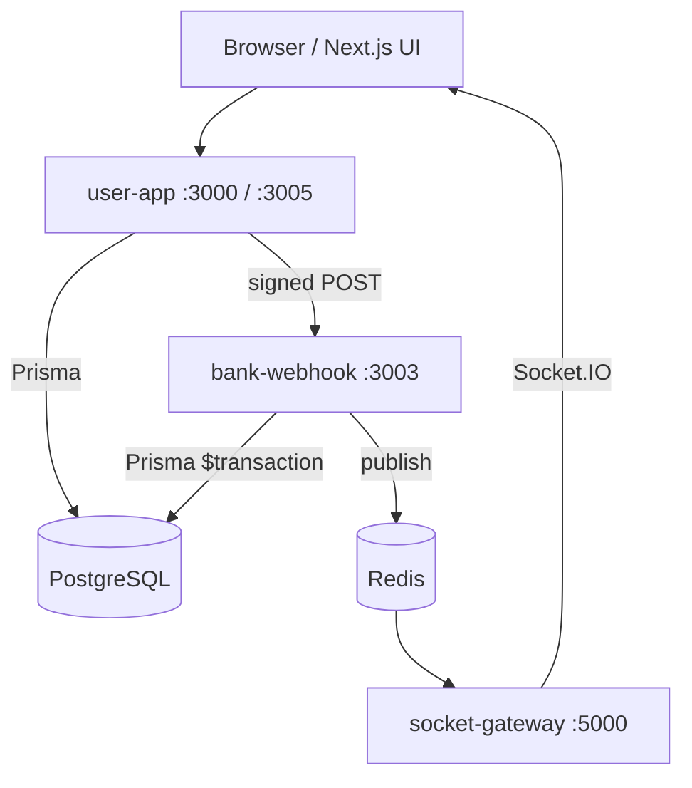

# PakPay

**PakPay** is a fintech MVP that simulates a digital wallet and merchant payment platform for Pakistan. End users can add money (on-ramp), withdraw (off-ramp), send P2P transfers, and pay verified merchants via QR or wallet. Merchants get dashboards, KYC onboarding, settlements (T+2), and PDF statements. Admins review KYC, disputes, and platform transactions.

**Live demo:** [https://pakpay10.site](https://pakpay10.site)

---

## Table of Contents

- [App Overview](#app-overview)
- [Tech Stack](#tech-stack)
- [Architecture](#architecture)
- [Getting Started](#getting-started)
- [Features](#features)
- [API Reference](#api-reference)
- [Database Schema](#database-schema)
- [Auth & Security](#auth--security)
- [Financial Logic](#financial-logic)
- [Deployment](#deployment)
- [Testing](#testing)
- [Known Limitations & TODOs](#known-limitations--todos)

---

## App Overview

| Audience | Value |
|----------|--------|
| **Consumers (USER)** | Wallet balance, bank-simulated top-up/withdraw, P2P by phone, pay merchants, disputes |
| **Merchants (MERCHANT)** | QR payments, analytics, settlements, KYC document upload, statements |
| **Admins (ADMIN)** | KYC approval, dispute refunds, transaction oversight |

Core value: a **production-style monorepo** demonstrating event-driven bank webhooks, signed HMAC callbacks, real-time Socket.IO notifications, and role-based access — suitable as a portfolio / demo system, not licensed production banking.

---

## Tech Stack

| Layer | Technology |
|-------|------------|
| Monorepo | Turborepo, Yarn workspaces |
| Frontend | Next.js 14 (App Router), React, Tailwind, Recoil (`@repo/store`) |
| API | Next.js Route Handlers (`apps/user-app/src/app/api/*`) |
| Auth | NextAuth.js (Credentials, JWT sessions, 30-day max age) |
| Bank simulation | Express (`apps/bank-webhook`), HMAC-SHA256 (`@repo/webhook-signing`) |
| Real-time | Socket.IO (`apps/socket-gateway`) + Redis pub/sub |
| Database | PostgreSQL + Prisma (`packages/db`) |
| Cache / rate limits | Redis |
| File uploads | Cloudinary (KYC, logos) |
| Email | Nodemailer (contact, password reset) |
| CI/CD | GitHub Actions → Docker Hub → AWS EC2 |
| Tests | Vitest (unit), Playwright (e2e), `security-test.js` (integration) |

---

## Architecture



**Pattern:** Modular monorepo with **thin API routes** and **no dedicated service layer** — business logic lives in route handlers, server actions, and `bank-webhook`. Financial mutations for bank flows are centralized in `bank-webhook`; P2P and admin refunds mutate balances directly in `user-app`.

```
PakPay/
├── apps/
│   ├── user-app/          # Next.js UI + /api routes
│   ├── bank-webhook/      # Balance mutations from bank callbacks
│   └── socket-gateway/    # WebSocket notifications
├── packages/
│   ├── db/                # Prisma schema & client
│   ├── store/             # Recoil balance atom
│   ├── webhook-signing/   # HMAC verify/sign
│   ├── ui/                # Shared UI components
│   └── config-*           # ESLint, Tailwind, TS configs
├── docker/                # Dockerfiles
├── docker-compose.yml
└── scripts/k6/            # Load smoke tests
```

---

## Getting Started

### Prerequisites

- Node.js ≥ 18
- Yarn 1.x
- PostgreSQL (or Docker)
- Redis (or Docker)

### Environment setup

```bash
cp .env.example .env
# Edit DATABASE_URL, secrets, URLs
```

### Environment variables

| Variable | Required | Description |
|----------|----------|-------------|
| `DATABASE_URL` | Yes | PostgreSQL connection string |
| `PRISMA_ACCELERATE_URL` | No | Prisma Accelerate (optional) |
| `NEXTAUTH_SECRET` / `JWT_SECRET` | Prod: Yes | Session signing (min 32 chars in prod) |
| `NEXTAUTH_URL` | Yes | Public app URL (e.g. `https://pakpay10.site`) |
| `NEXT_PUBLIC_BASE_URL` | Yes | Baked at build; QR / pay links |
| `NEXT_PUBLIC_SOCKET_URL` | Yes | Socket gateway URL (baked at build) |
| `BANK_WEBHOOK_URL` | Yes | e.g. `http://bank-webhook:3003` |
| `BANK_WEBHOOK_SECRET` | Yes | Shared HMAC secret (user-app + bank-webhook) |
| `REDIS_URL` | Yes | Rate limits, login lockout, pub/sub |
| `CRON_SECRET` | Prod: Yes | Bearer for `/api/cron/auto-settlement` |
| `SOCKET_CORS_ORIGIN` | Yes | Allowed Socket.IO origin |
| `EMAIL_USER` / `EMAIL_PASS` | No | SMTP for contact & reset |
| `CLOUDINARY_*` | No | KYC / logo uploads |
| `ENFORCE_HTTPS` | No | Redirect HTTP→HTTPS on app routes |
| `ENABLE_HSTS` | No | HSTS header when behind TLS |
| `LOG_LEVEL` | No | `info` (prod) / `debug` (dev) |

> Never commit `.env`. Seed passwords go in gitignored `packages/db/prisma/seed.credentials.local.ts`.

### Install, migrate, seed, run

**Docker (recommended):**

```bash
docker compose up -d --build
docker exec -it <user-app-container> npx prisma migrate deploy --schema=packages/db/prisma/schema.prisma
npm run db:seed   # from host, with DATABASE_URL pointing at DB
```

| Service | Host port |
|---------|-----------|
| user-app | 3005 → 3000 |
| bank-webhook | 4000 → 3003 |
| socket-gateway | 5000 |
| redis | 6379 |

**Local dev (no Docker):**

```bash
yarn install
npm run db:generate
npm run db:migrate
cp packages/db/prisma/seed.credentials.example.ts packages/db/prisma/seed.credentials.local.ts
npm run db:seed
# Terminal 1: user-app
cd apps/user-app && yarn dev
# Terminal 2: bank-webhook
cd apps/bank-webhook && yarn dev
# Terminal 3: socket-gateway
cd apps/socket-gateway && yarn dev
```

**Production build:**

```bash
npm run build
npm run start-user-app
npm run start-bank-webhook
```

---

## Features

| Feature | Behavior |
|---------|----------|
| **Registration** | Email + phone + password; roles `USER` or `MERCHANT`; creates `Balance` at 0; merchant gets `MerchantProfile` |
| **Sign in** | NextAuth credentials; Redis login lockout after failures |
| **Password reset** | Hashed token, 15 min expiry, email link |
| **Wallet on-ramp** | Creates `OnRampTransaction` (Processing); client calls `/api/onramp-proxy` → signed `hdfcWebHook` credits balance |
| **Wallet off-ramp** | Creates `OffRampTransaction`; proxy → `withdrawWebHook` debits balance |
| **P2P transfer** | Server action; `SELECT FOR UPDATE` on sender balance; atomic debit/credit |
| **Pay merchant** | Balance check → `MerchantTransaction` PENDING → `merchantWebHook` moves funds |
| **QR pay** | Public `/pay?mid=&type=&ref=`; merchant must be KYC VERIFIED |
| **Merchant KYC** | Upload CNIC + proof via Cloudinary; admin APPROVE/REJECT |
| **Settlements** | Cron T+2: group unsettled SUCCESS txns, create `Settlement`, debit merchant via webhook |
| **Disputes** | User opens on SUCCESS txn; admin REFUND (balance reversal) or REJECT |
| **Analytics** | Merchant 30d revenue, daily chart, top customers |
| **Statements** | PDF export by month or date range |
| **Real-time** | Redis events → Socket.IO (`paymentEvent`, `settlementEvent`, `bankWebhookEvent`) |
| **Admin** | List merchants, transactions, manage KYC & disputes |
| **Contact** | Public form with IP rate limit + SMTP |

---

## API Reference

Base URL: `{NEXT_PUBLIC_BASE_URL}/api`. Auth = NextAuth session cookie unless noted.

### Auth

| Method | Path | Auth | Request | Response |
|--------|------|------|---------|----------|
| GET/POST | `/auth/[...nextauth]` | — | NextAuth flows | Session / CSRF |
| POST | `/auth/login` | No | `{ email, password }` | `{ success, message }` (no cookie) |
| POST | `/auth/forgot-password` | No | `{ email }` | Generic success |
| POST | `/auth/reset-password` | No | `{ token, password }` | Success / error |
| GET | `/auth/verify-reset-token` | No | `?token=` | `{ valid: boolean }` |

### User

| Method | Path | Auth | Request | Response |
|--------|------|------|---------|----------|
| POST | `/register` | No | `registerBodySchema` | 201 `{ success, message }` |
| GET | `/user` | Session | — | `{ user: { id, name, email, role } }` |
| GET | `/spending` | Session | — | Weekly aggregates (on/off-ramp, p2p) |

### Wallet

| Method | Path | Auth | Request | Response |
|--------|------|------|---------|----------|
| POST | `/create-onramp` | Session | `{ amount, bank }` | `{ success, transaction }` |
| POST | `/create-offramp` | Session | `createOffRampSchema` | `{ success, transaction }` |
| POST | `/onramp-proxy` | Session (own userId) | `{ token, userId, amount? }` | `{ success: true }` |
| POST | `/offramp-proxy` | Session (own userId) | `{ token, user_identifier, amount? }` | `{ success: true }` |

### Payments

| Method | Path | Auth | Request | Response |
|--------|------|------|---------|----------|
| POST | `/pay` | Session USER | `{ merchantId, amount, ref?, paymentMethod? }` | `{ success, payment }` |
| GET | `/pay/merchant` | **Public** | `?mid=` profile id | Merchant public info |

### Merchant

| Method | Path | Auth | Request | Response |
|--------|------|------|---------|----------|
| GET/POST | `/qr` | Session MERCHANT | POST: profile fields | Profile + QR payload |
| GET | `/merchant` | Session | — | Profile + QR |
| POST | `/merchant/kyc-documents` | Session MERCHANT | multipart files | `{ ok: true }` |
| GET | `/merchant/transactions` | Session MERCHANT | — | `{ payments, settlements }` |
| GET | `/merchant/analytics` | Session MERCHANT | — | Revenue metrics |
| GET | `/merchant/statement` | Session MERCHANT | `?month=` or `?from=&to=` | PDF |

### Disputes & admin

| Method | Path | Auth | Request | Response |
|--------|------|------|---------|----------|
| GET/POST | `/disputes` | Session | POST: `{ merchantTransactionId, reason }` | Dispute rows |
| GET | `/admin/merchants` | ADMIN | — | All profiles |
| POST | `/admin/kyc` | ADMIN | `{ merchantId, action, reason? }` | KYC update |
| GET | `/admin/transactions` | ADMIN | — | Platform txns |
| POST | `/admin/disputes` | ADMIN | `{ disputeId, action, note? }` | `{ ok: true }` |

### Other

| Method | Path | Auth | Request | Response |
|--------|------|------|---------|----------|
| POST | `/contact` | No (rate limited) | `{ name, email, message }` | Success |
| POST | `/cron/auto-settlement` | Bearer `CRON_SECRET` | — | Settlement summary |

### Bank-webhook service (internal)

| Method | Path | Auth | Body |
|--------|------|------|------|
| GET | `/health` | No | — |
| POST | `/hdfcWebHook` | HMAC | `{ token, userId, amount }` |
| POST | `/withdrawWebHook` | HMAC | `{ token, user_identifier, amount }` |
| POST | `/merchantWebHook` | HMAC | `{ token, merchantId, amount, customerId }` |
| POST | `/merchantSettlementWebHook` | HMAC | `{ settlementId, merchantId, amount }` |

Header: `x-pakpay-signature: sha256=<hex>` over raw JSON body.

---

## Database Schema

All amounts are stored as **integers** (intended as minor units / paisa in UI, but some flows send whole PKR — see [Financial Logic](#financial-logic)).

### Tables

| Model | Key fields | Relationships |
|-------|------------|---------------|
| `User` | email?, number (unique), password, role | → Balance, transfers, ramps, disputes |
| `Balance` | userId (unique), amount, locked | → User |
| `MerchantProfile` | userId, kycStatus, qrPayload, docs URLs | → User, transactions, settlements |
| `MerchantTransaction` | merchantId, customerId?, amount, status, ref?, settled | → Merchant, customer, settlement |
| `Settlement` | merchantId, amount, status, scheduledFor | → Merchant, transactions |
| `SettlementLock` | id=1, locked | Cron idempotency |
| `p2pTransfer` | fromUserId, toUserId, amount, timestamp | → Users |
| `OnRampTransaction` | token (unique), status, amount, provider | → User |
| `OffRampTransaction` | token (unique), status, bank fields | → User |
| `Dispute` | transactionId, userId, status | → MerchantTransaction, User |
| `AuditLog` | merchantId, action, performedBy | → MerchantProfile |

### Enums

- `UserRole`: USER, MERCHANT, ADMIN
- `KycStatus`: PENDING, SUBMITTED, VERIFIED, REJECTED
- `TransactionStatus`: SUCCESS, FAILED, PENDING
- `SettlementStatus`: PROCESSING, SUCCESS, FAILED, PENDING
- `PaymentMethod`: QR, CARD, WALLET, BANK_TRANSFER

### Indexes (implicit via Prisma)

Unique: `User.email`, `User.number`, `OnRampTransaction.token`, `OffRampTransaction.token`, `MerchantTransaction.ref`, `MerchantProfile.userId`, `MerchantProfile.qrPayload`.

---

## Auth & Security

### Flow

1. User signs in via `/auth/signin` → NextAuth Credentials → bcrypt verify.
2. JWT issued (30 days); `session.user.id` and `session.user.role` exposed.
3. Page routes `/user/*`, `/merchant/*`, `/admin/*` guarded by `apps/user-app/middleware.ts` (role redirects).
4. API routes call `getServerSession(authOptions)` per handler.

### Role permissions

| Action | USER | MERCHANT | ADMIN |
|--------|------|----------|-------|
| Wallet / P2P / pay | ✅ | — | — |
| Merchant dashboard / KYC | — | ✅ | — |
| Admin KYC / disputes / txns | — | — | ✅ |
| Public pay page (verified merchant) | ✅ | ✅ | ✅ |

### Security measures

- HMAC-signed bank webhooks (production enforced)
- Redis rate limits (pay, register, on-ramp, contact)
- Login lockout (Redis)
- Password reset tokens hashed
- Cron bearer auth in production
- Webhook IP rate limit (120/min)

---

## Financial Logic

### Transaction lifecycle

1. **On-ramp:** `Processing` → webhook → `Success` + balance `+= amount`
2. **Off-ramp:** `Processing` → webhook → `Success` + balance `-= amount` (or `Failure`)
3. **Merchant pay:** `PENDING` at create → webhook → `SUCCESS` + customer `-=` / merchant `+=`
4. **P2P:** Single DB transaction with row lock on sender
5. **Settlement:** Cron marks txns `settled`, creates `Settlement`, webhook debits merchant `Balance`
6. **Refund:** Admin dispute REFUND reverses balances, txn `FAILED` + `refunded`

### Balance calculations

- **User wallet UI:** `Balance.amount` (display often `/100`)
- **Merchant “available” dashboard:** sum of **settled** SUCCESS `MerchantTransaction` amounts (not `Balance.amount`)
- **`Balance.locked`:** seeded/displayed but not updated in transfer flows

### Edge cases & known gaps

- **Amount units:** P2P multiplies input ×100; on-ramp/pay send raw PKR — inconsistent (see limitations).
- **Merchant pay race:** Balance checked in `/api/pay` before async webhook debit.
- **Webhook partial failure:** `merchantWebHook` updates balances in `$transaction` but status update is separate.
- **Settlement:** Txns marked `settled` before settlement webhook succeeds.
- **Idempotency:** Duplicate `ref` on pay returns existing txn without re-webhook.

---

## Deployment

1. Set GitHub Secrets (see existing CI table in repo).
2. Push to `main` → Actions builds Docker images with `NEXT_PUBLIC_*` build args.
3. EC2: `docker compose pull && docker compose up -d --no-build`.
4. Run migrations inside user-app container.
5. Schedule cron: `POST /api/cron/auto-settlement` with `Authorization: Bearer $CRON_SECRET` (e.g. daily).

**Rebuild required** when changing `NEXT_PUBLIC_BASE_URL` or `NEXT_PUBLIC_SOCKET_URL`.

---

## Testing

```bash
npm ci
npm run db:generate:no-engine
npm test                    # Vitest
node security-test.js       # Integration/security (needs running services)
cd apps/user-app && npm run test:e2e   # Playwright
```

Load smoke: `BASE_URL=http://localhost:3005 k6 run scripts/k6/pay-smoke.js`

---

## Known Limitations & TODOs

- Simulated bank (on/off-ramp proxy) — not a real payment gateway
- No PCI / card processor integration
- KYC is document upload + manual admin review (no automated AML/KYC vendor)
- Amount unit inconsistency between P2P and wallet/merchant flows
- Merchant dashboard balance ≠ `Balance` table after settlement
- No 2FA, OAuth, or mobile app
- Low automated test coverage
- Roadmap items in prior README still apply (Stripe, fraud detection, K8s, etc.)

---

## Contributing

Fork → feature branch → PR. Do not commit `.env` or `seed.credentials.local.ts`.

## License

See repository license file if present.
